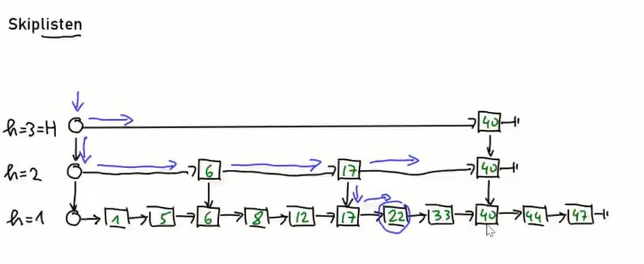

# skiplists 

- randomisierte Datenstrukturen ( basieren auf Listen )
- Reihenfolge sortiert
- suchen sequentiell
- Suchen mit binärer Suche in O(log n)
- Grundidee: die Fähigkeit zu springen und nicht immer sequentiell laufen zu müssen.

## suchen O(log_2(h))

- Kopie machen von jedem n-ten Element
- somit entsteht eine weiter Stufe die nur aus einigen Elementen besteht. 
- man vergleicht das zu suchende Element mit den Elementen dieser neuen Stufe 
- Beim finden des passenden Bereiches geht man zurück und sucht sequentiell in der originalen Liste. 
### zeit des Suchens
- hängt von dem Abstand, den man zwischen den kopierten Elementen auswählt. 
- Beispiel:
  - wählt man nur jede 3 Elemente der originalen Liste, um die höhere Stufe zu erstellen, dann bracht man nur zwischen maximal 3 Elementen zu suchen, wenn man in der originalen Liste zurückschauen möchte.

## Stufen oder Ebenen:
- die originale Liste hat die Höhe h = 1
- Stufe 2 hat Höhe h = 2
- usw. 

## max. Höhe
- hängt von dem ausgewählten Abstand zwischen den Elementen im ersten Trenn-Prozess.

